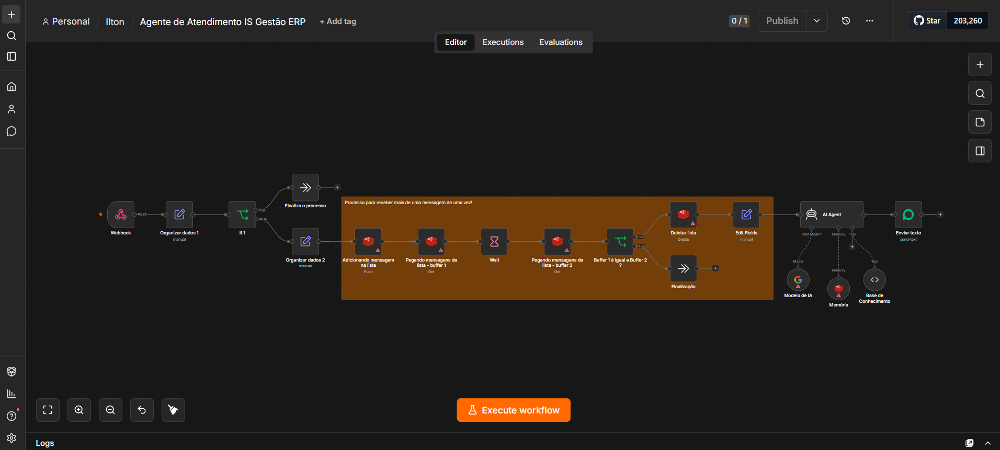

# 🤖 Assistente de Atendimento — IS Gestão ERP (WhatsApp + IA)

## 📌 Visão Geral

Assistente virtual de atendimento via WhatsApp para o IS Gestão ERP, construído em n8n com Evolution API. Tira dúvidas de clientes sobre módulos, planos e funcionalidades do sistema, com memória de conversa e escalonamento automático para atendimento humano em casos sensíveis.

## 🎯 O Problema

- Dúvidas repetitivas sobre o sistema (módulos, planos, funcionalidades) consomem tempo de atendimento manual.
- Mensagens enviadas em sequência pelo cliente, se respondidas uma a uma, geram respostas picadas e desorganizadas.
- Um agente de IA sem controle claro pode tentar resolver sozinho casos que exigem intervenção humana (cancelamento, reclamação).

## 💡 Solução Implementada

- Webhook da Evolution API recebe as mensagens do WhatsApp.
- Bufferização de mensagens (debounce): agrupa mensagens enviadas em sequência pelo cliente antes de responder, evitando respostas fragmentadas.
- Consulta a uma base de conhecimento própria sobre o sistema (módulos, planos, funcionalidades).
- Agente de IA com memória de conversa conduz o atendimento.
- Escalonamento automático para atendimento humano em casos sensíveis (cancelamento, reclamação, pedido explícito de atendimento humano) — o bot nunca decide sozinho.

## 🛠️ Stack Tecnológica

n8n · Evolution API (WhatsApp) · Agentes de IA · Memória de conversa · Webhooks · Base de conhecimento própria

## 🔒 Decisões de Engenharia

- **Bufferização com debounce:** evita que o agente responda a cada mensagem isoladamente quando o cliente digita em várias partes seguidas.
- **Escalonamento humano obrigatório:** casos sensíveis são sempre encaminhados para a equipe, sem decisão autônoma da IA.
- **Memória de conversa:** mantém contexto entre interações do mesmo cliente.

## 📊 Status

🟢 Em produção.

## 🔐 Nota

Este repositório documenta a arquitetura e as decisões de engenharia do projeto. O JSON de exportação do workflow (que contém credenciais e IDs internos) não é versionado publicamente aqui.
